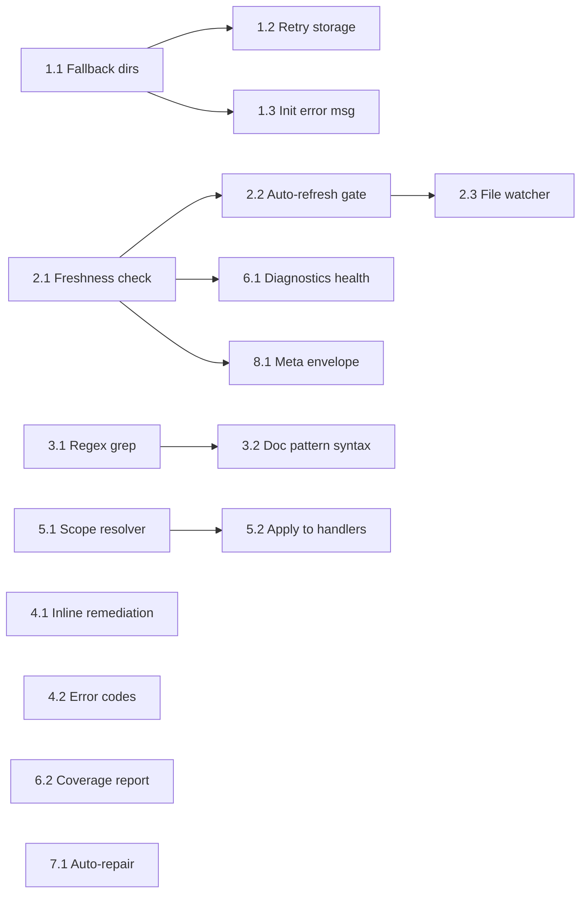

# LeIndex Reliability & Completeness — Action Plan

> **Goal**: Address every issue in the LeIndex Tools Evaluation Report so that
> LeIndex tools reach ≥99% operational reliability, eliminating the need to fall
> back to shell commands or non-LeIndex tools.

---

## Priority Legend

| Tag | Meaning |
|-----|---------|
| 🔴 P0 | **Critical** — causes total tool failure; blocks all usage |
| 🟠 P1 | **High** — causes incorrect/stale results or major UX friction |
| 🟡 P2 | **Medium** — quality-of-life, performance, self-healing |
| 🟢 P3 | **Low** — debugging aids, nice-to-haves |

---

## Work Stream 1 — Index Initialization Resilience (🔴 P0)

### Problem
`LeIndex::new()` in `crates/lepasserelle/src/leindex.rs:496-510` does a single
`fs::create_dir_all(.leindex)` and immediately fails with a bare `anyhow`
context if the directory can't be created. There is no retry, no fallback
location, and no actionable error message.

### ✅ Task 1.1 — Multi-location fallback for `.leindex` directory
**File**: `crates/lepasserelle/src/leindex.rs`
**Blocking**: nothing

Replace the single `create_dir_all` call with a location chain:

```rust
// leindex.rs – inside LeIndex::new(), replacing lines 508-510

fn resolve_storage_path(project_path: &Path) -> anyhow::Result<PathBuf> {
    // 1. Prefer in-project .leindex
    let in_project = project_path.join(".leindex");
    if try_create_dir(&in_project) {
        return Ok(in_project);
    }

    // 2. LEINDEX_HOME env var
    if let Ok(home) = std::env::var("LEINDEX_HOME") {
        let dir_name = project_path
            .file_name()
            .and_then(|n| n.to_str())
            .unwrap_or("unknown");
        let hash = &blake3::hash(project_path.to_string_lossy().as_bytes())
            .to_hex()[..12];
        let env_path = PathBuf::from(home)
            .join(format!("{}-{}", dir_name, hash));
        if try_create_dir(&env_path) {
            return Ok(env_path);
        }
    }

    // 3. XDG_DATA_HOME / ~/.local/share/leindex/<hash>
    let xdg_dir = dirs::data_dir()
        .unwrap_or_else(|| PathBuf::from("/tmp"))
        .join("leindex")
        .join(blake3::hash(project_path.to_string_lossy().as_bytes())
            .to_hex()[..16].to_string());
    if try_create_dir(&xdg_dir) {
        return Ok(xdg_dir);
    }

    // 4. /tmp fallback
    let tmp_path = std::env::temp_dir()
        .join("leindex")
        .join(blake3::hash(project_path.to_string_lossy().as_bytes())
            .to_hex()[..16].to_string());
    std::fs::create_dir_all(&tmp_path)
        .with_context(|| format!(
            "Failed to create .leindex directory.\n\
             Tried:\n  1. {}\n  2. $LEINDEX_HOME\n  3. {}\n  4. {}\n\n\
             Fix: Check directory permissions, or set LEINDEX_HOME env var.",
            in_project.display(),
            xdg_dir.display(),
            tmp_path.display(),
        ))?;
    Ok(tmp_path)
}

fn try_create_dir(path: &Path) -> bool {
    std::fs::create_dir_all(path).is_ok()
        && std::fs::metadata(path)
            .map(|m| m.permissions().readonly() == false)
            .unwrap_or(false)
}
```

Then in `LeIndex::new()`:
```rust
let storage_path = resolve_storage_path(&project_path)?;
```

### ✅ Task 1.2 — Retry with exponential backoff on storage open
**File**: `crates/lepasserelle/src/leindex.rs`
**Blocking**: Task 1.1

Wrap `Storage::open` with a retry loop (e.g., for SQLite BUSY locks):
```rust
fn open_storage_with_retry(db_path: &Path, max_retries: u32) -> anyhow::Result<Storage> {
    let mut attempt = 0;
    loop {
        match Storage::open(db_path) {
            Ok(s) => return Ok(s),
            Err(e) if attempt < max_retries => {
                attempt += 1;
                let delay = std::time::Duration::from_millis(100 * 2u64.pow(attempt));
                tracing::warn!(
                    "Storage open attempt {}/{} failed: {}. Retrying in {:?}",
                    attempt, max_retries, e, delay
                );
                std::thread::sleep(delay);
            }
            Err(e) => {
                return Err(e).with_context(|| format!(
                    "Failed to open storage at {} after {} attempts.\n\
                     Suggestion: Delete {} and re-index, or check disk space.",
                    db_path.display(), max_retries, db_path.display()
                ));
            }
        }
    }
}
```

### ✅ Task 1.3 — Enriched `JsonRpcError` for init failures
**File**: `crates/lepasserelle/src/mcp/protocol.rs`
**Blocking**: nothing

Add a new constructor that carries actionable remediation:
```rust
impl JsonRpcError {
    /// Create an initialization failure error with multi-step remediation.
    pub fn init_failed(path: &str, inner: &str) -> Self {
        Self::with_data(
            error_codes::INDEXING_FAILED,
            format!("Failed to initialize LeIndex for '{}'", path),
            serde_json::json!({
                "error_type": "init_failed",
                "inner_error": inner,
                "remediation": [
                    format!("1. Check write permissions on {}", path),
                    "2. Set LEINDEX_HOME=/writable/path env var",
                    "3. Delete .leindex/ directory and retry",
                    "4. Use --index-path <path> CLI flag"
                ]
            }),
        )
    }
}
```

Update `registry.rs:205-211` to use it:
```rust
let mut leindex = LeIndex::new(&canonical).map_err(|e| {
    JsonRpcError::init_failed(
        &canonical.display().to_string(),
        &e.to_string(),
    )
})?;
```

---

## Work Stream 2 — Index Staleness / Auto-Refresh (🔴 P0)

### Problem
After file edits, the in-memory PDG and search index remain stale.
`force_reindex: true` rebuilds everything from scratch—slow and disruptive.
The `BackgroundSync` in `leglobal/src/sync.rs` exists but isn't wired into the
MCP tool handlers.

### ✅ Task 2.1 — Per-file freshness check before queries
**File**: `crates/lepasserelle/src/leindex.rs`
**Blocking**: nothing

Add a method that checks if any files changed since last index:
```rust
/// Check which source files have changed since last index.
/// Returns (changed_paths, deleted_paths).
pub fn check_freshness(&self) -> anyhow::Result<(Vec<PathBuf>, Vec<String>)> {
    let indexed_files =
        lestockage::pdg_store::get_indexed_files(&self.storage, &self.project_id)
            .unwrap_or_default();

    let current = self.collect_source_files_with_hashes()?;
    let current_map: std::collections::HashMap<String, String> = current
        .iter()
        .map(|(p, h)| (p.display().to_string(), h.clone()))
        .collect();

    let changed: Vec<PathBuf> = current
        .iter()
        .filter(|(p, h)| {
            let key = p.display().to_string();
            indexed_files.get(&key) != Some(h)
        })
        .map(|(p, _)| p.clone())
        .collect();

    let deleted: Vec<String> = indexed_files
        .keys()
        .filter(|k| !current_map.contains_key(*k))
        .cloned()
        .collect();

    Ok((changed, deleted))
}

/// Quick staleness check without computing hashes—uses mtime only.
pub fn is_stale_fast(&self) -> bool {
    let index_mtime = self.storage_path()
        .join("leindex.db")
        .metadata()
        .and_then(|m| m.modified())
        .ok();

    let Some(db_time) = index_mtime else { return true };

    // Spot-check a sample of source files
    let files = self.collect_source_file_paths().unwrap_or_default();
    let sample_size = (files.len() / 10).max(5).min(files.len());
    files.iter().take(sample_size).any(|f| {
        f.metadata()
            .and_then(|m| m.modified())
            .map(|t| t > db_time)
            .unwrap_or(false)
    })
}
```

### ✅ Task 2.2 — Auto-refresh gate in `ProjectRegistry::get_or_create`
**File**: `crates/lepasserelle/src/registry.rs`
**Blocking**: Task 2.1

Before returning a handle, check freshness and do incremental reindex:
```rust
pub async fn get_or_create(
    &self,
    project_path: Option<&str>,
) -> Result<ProjectHandle, JsonRpcError> {
    let handle = self.get_or_load(project_path).await?;

    let (needs_index, needs_refresh) = {
        let idx = handle.lock().await;
        let not_indexed = !idx.is_indexed();
        let stale = !not_indexed && idx.is_stale_fast();
        (not_indexed, stale)
    };

    if needs_index {
        let _ = self.index_handle(&handle, false).await?;
    } else if needs_refresh {
        // Incremental reindex — only changed files
        let _ = self.index_handle(&handle, false).await?;
        tracing::debug!("Auto-refreshed stale index");
    }

    Ok(handle)
}
```

### ✅ Task 2.3 — File watcher integration (async)
**File**: New file `crates/lepasserelle/src/watcher.rs`
**Blocking**: Task 2.2
**Dependency**: Add `notify = "7"` to `crates/lepasserelle/Cargo.toml`

```rust
use notify::{RecommendedWatcher, RecursiveMode, Watcher, Event, EventKind};
use std::path::PathBuf;
use std::sync::Arc;
use tokio::sync::mpsc;
use tracing::{debug, warn};

use crate::registry::ProjectRegistry;

/// Watches project directories and triggers incremental reindex on file changes.
pub struct IndexWatcher {
    _watcher: RecommendedWatcher,
}

impl IndexWatcher {
    pub fn start(
        project_path: PathBuf,
        registry: Arc<ProjectRegistry>,
    ) -> anyhow::Result<Self> {
        let (tx, mut rx) = mpsc::channel::<PathBuf>(256);

        let mut watcher = notify::recommended_watcher(move |res: Result<Event, _>| {
            if let Ok(event) = res {
                match event.kind {
                    EventKind::Modify(_) | EventKind::Create(_) | EventKind::Remove(_) => {
                        for path in event.paths {
                            let _ = tx.try_send(path);
                        }
                    }
                    _ => {}
                }
            }
        })?;

        watcher.watch(&project_path, RecursiveMode::Recursive)?;

        // Debounced consumer — coalesces events over 500ms window
        let proj_str = project_path.to_string_lossy().to_string();
        tokio::spawn(async move {
            let mut debounce = tokio::time::interval(
                tokio::time::Duration::from_millis(500),
            );
            let mut dirty = false;

            loop {
                tokio::select! {
                    Some(_path) = rx.recv() => {
                        dirty = true;
                    }
                    _ = debounce.tick() => {
                        if dirty {
                            dirty = false;
                            debug!("File changes detected, triggering incremental reindex");
                            if let Err(e) = registry
                                .index_project(Some(&proj_str), false)
                                .await
                            {
                                warn!("Auto-reindex failed: {}", e);
                            }
                        }
                    }
                }
            }
        });

        Ok(Self { _watcher: watcher })
    }
}
```

---

## Work Stream 3 — grep_symbols Search Accuracy (🟠 P1)

### Problem
`leindex_grep_symbols` with patterns like `"blocking_read|blocking_write"`
returns 0 results because the search engine doesn't support regex/pipe syntax.
The search pre-filter uses semantic search which may not surface exact substring
matches.

### ✅ Task 3.1 — Add regex pattern support to grep_symbols
**File**: `crates/lepasserelle/src/mcp/handlers.rs` (around line 1790-1845)
**Blocking**: nothing

After the semantic pre-filter, add a direct PDG scan fallback when 0 results:
```rust
// Inside GrepSymbolsHandler::execute(), after candidate_results

// If semantic search returned nothing useful, fall back to direct PDG scan
// This handles regex patterns, pipe-separated alternatives, etc.
let use_direct_scan = candidate_results.is_empty()
    || pattern.contains('|')
    || pattern.contains('*')
    || pattern.contains('?')
    || pattern.contains('[');

if use_direct_scan {
    // Try to compile as regex; fall back to substring if invalid
    let re = regex::Regex::new(&pattern).ok();

    for node_idx in pdg.node_indices() {
        if all_matches.len() >= fetch_limit {
            break;
        }
        let Some(node) = pdg.get_node(node_idx) else { continue };

        let name_matches = if let Some(ref re) = re {
            re.is_match(&node.name) || re.is_match(&node.id)
        } else {
            node.name.to_lowercase().contains(&pattern_lower)
                || node.id.to_lowercase().contains(&pattern_lower)
        };

        if !name_matches || seen_ids.contains(&node.id) {
            continue;
        }

        // Apply type_filter and scope filter (same as existing code)
        if type_filter != "all" && node_type_str(&node.node_type) != type_filter {
            continue;
        }
        if let Some(ref s) = scope {
            if !node.file_path.starts_with(s.as_str()) {
                continue;
            }
        }

        seen_ids.insert(node.id.clone());
        // ... build entry JSON same as existing code ...
    }
}
```

**Dependency**: Add `regex = "1"` to `crates/lepasserelle/Cargo.toml`

### ✅ Task 3.2 — Document pattern syntax in tool description
**File**: `crates/lepasserelle/src/mcp/handlers.rs` (GrepSymbolsHandler::description)
**Blocking**: Task 3.1

```rust
pub fn description(&self) -> &str {
    "Search for symbols across the indexed codebase with structural awareness. \
Unlike text-based grep, results include each match's type (function/class/method) \
and its role in the dependency graph.\n\n\
Pattern syntax:\n\
- Simple substring: 'Manager' matches any symbol containing 'Manager'\n\
- Regex: 'blocking_(read|write)' matches both blocking_read and blocking_write\n\
- Pipe alternatives: 'foo|bar' matches symbols containing 'foo' or 'bar'\n\
- Case-insensitive by default"
}
```

---

## Work Stream 4 — Actionable Error Messages (🟠 P1)

### Problem
Errors like `"MCP tool 'leindex_search' reported tool error"` provide no
actionable remediation. The `JsonRpcError` already has a `data` field with
suggestions, but the MCP protocol surfaces only `message`.

### ✅ Task 4.1 — Embed remediation steps in error `message` field
**File**: `crates/lepasserelle/src/mcp/protocol.rs`
**Blocking**: nothing

Modify each error constructor to inline suggestions into the `message`:
```rust
pub fn indexing_failed(msg: impl Into<String>) -> Self {
    let m = msg.into();
    Self::with_data(
        error_codes::INDEXING_FAILED,
        format!(
            "{}\n\nRemediation:\n\
             1. Verify project_path is a valid directory with source files\n\
             2. Try force_reindex=true to rebuild the index\n\
             3. Delete .leindex/ directory and retry\n\
             4. Check disk space and permissions",
            m
        ),
        serde_json::json!({
            "error_type": "indexing_failed",
        }),
    )
}

pub fn search_failed(msg: impl Into<String>) -> Self {
    let m = msg.into();
    Self::with_data(
        error_codes::SEARCH_FAILED,
        format!(
            "{}\n\nRemediation:\n\
             1. Ensure the project is indexed (call leindex_index)\n\
             2. Try a simpler query (single term instead of complex pattern)\n\
             3. Use leindex_grep_symbols for exact/regex pattern matching\n\
             4. Try force_reindex=true if the index may be stale",
            m
        ),
        serde_json::json!({ "error_type": "search_failed" }),
    )
}
```

### ✅ Task 4.2 — Add `error_code` classification enum
**File**: `crates/lepasserelle/src/mcp/protocol.rs`
**Blocking**: nothing

```rust
pub mod error_codes {
    pub const PARSE_ERROR: i32 = -32700;
    pub const INVALID_REQUEST: i32 = -32600;
    pub const METHOD_NOT_FOUND: i32 = -32601;
    pub const INVALID_PARAMS: i32 = -32602;
    pub const INTERNAL_ERROR: i32 = -32603;

    // LeIndex-specific codes
    pub const PROJECT_NOT_FOUND: i32 = -32001;
    pub const PROJECT_NOT_INDEXED: i32 = -32002;
    pub const INDEXING_FAILED: i32 = -32003;
    pub const SEARCH_FAILED: i32 = -32004;
    pub const CONTEXT_EXPANSION_FAILED: i32 = -32005;
    pub const MEMORY_LIMIT_EXCEEDED: i32 = -32006;
    pub const INDEX_STALE: i32 = -32007;        // NEW
    pub const INIT_FAILED: i32 = -32008;         // NEW
    pub const FILESYSTEM_ERROR: i32 = -32009;    // NEW
}
```

---

## Work Stream 5 — Scope/Path Handling Consistency (🟠 P1)

### Problem
The `scope` parameter behaves inconsistently across tools. Path resolution
sometimes fails silently. Some handlers canonicalize paths while others don't.

### ✅ Task 5.1 — Centralize scope resolution
**File**: New function in `crates/lepasserelle/src/mcp/handlers.rs`
**Blocking**: nothing

```rust
/// Resolve and normalize a scope path for consistent filtering.
/// Returns None if no scope was provided.
/// Returns Err if the scope path is invalid.
fn resolve_scope(
    args: &Value,
    project_root: &std::path::Path,
) -> Result<Option<String>, JsonRpcError> {
    let raw = match args.get("scope").and_then(|v| v.as_str()) {
        Some(s) if !s.is_empty() => s,
        _ => return Ok(None),
    };

    let path = std::path::Path::new(raw);

    // If relative, resolve against project root
    let resolved = if path.is_relative() {
        project_root.join(path)
    } else {
        path.to_path_buf()
    };

    let canonical = resolved.canonicalize().map_err(|e| {
        JsonRpcError::invalid_params_with_suggestion(
            format!("Cannot resolve scope path '{}': {}", raw, e),
            format!(
                "Use an absolute path or a path relative to the project root: {}",
                project_root.display()
            ),
        )
    })?;

    let mut s = canonical.to_string_lossy().to_string();
    if canonical.is_dir() && !s.ends_with(std::path::MAIN_SEPARATOR) {
        s.push(std::path::MAIN_SEPARATOR);
    }

    Ok(Some(s))
}
```

### ✅ Task 5.2 — Apply `resolve_scope` to all handlers that accept `scope`
**Files**: `crates/lepasserelle/src/mcp/handlers.rs`
**Blocking**: Task 5.1

Replace inline scope resolution in:
- `GrepSymbolsHandler::execute()` (lines 1777-1789)
- `SymbolLookupHandler::execute()`
- `ProjectMapHandler::execute()`
- `SearchHandler::execute()`

Each handler should call:
```rust
let scope = resolve_scope(&args, index.project_path())?;
```

---

## Work Stream 6 — Diagnostics & Health Check (🟡 P2)

### Problem
No pre-operation health check. When things go wrong, there's no tool to
diagnose why.

### ✅ Task 6.1 — Enrich `leindex_diagnostics` with health report
**File**: `crates/lepasserelle/src/mcp/handlers.rs` (DiagnosticsHandler)
**Blocking**: Task 2.1

Add to the diagnostics response:
```rust
// In DiagnosticsHandler::execute()
let (changed, deleted) = index.check_freshness()
    .unwrap_or_else(|_| (vec![], vec![]));

let staleness = if changed.is_empty() && deleted.is_empty() {
    serde_json::json!({
        "status": "fresh",
        "changed_files": 0,
        "deleted_files": 0,
    })
} else {
    serde_json::json!({
        "status": "stale",
        "changed_files": changed.len(),
        "deleted_files": deleted.len(),
        "changed_sample": changed.iter()
            .take(10)
            .map(|p| p.display().to_string())
            .collect::<Vec<_>>(),
        "suggestion": "Call leindex_index with force_reindex=true to refresh",
    })
};

// Add to response JSON:
// "freshness": staleness,
// "storage_path": storage_path.display().to_string(),
// "db_size_bytes": db_file_size,
```

### ✅ Task 6.2 — Add index coverage report
**File**: `crates/lepasserelle/src/leindex.rs`
**Blocking**: nothing

```rust
/// Report which files are indexed and which are not.
pub fn coverage_report(&self) -> anyhow::Result<CoverageReport> {
    let indexed_files =
        lestockage::pdg_store::get_indexed_files(&self.storage, &self.project_id)
            .unwrap_or_default();
    let source_files = self.collect_source_file_paths()?;

    let indexed_set: std::collections::HashSet<String> =
        indexed_files.keys().cloned().collect();
    let source_set: std::collections::HashSet<String> = source_files
        .iter()
        .map(|p| p.display().to_string())
        .collect();

    let missing: Vec<String> = source_set.difference(&indexed_set).cloned().collect();
    let orphaned: Vec<String> = indexed_set.difference(&source_set).cloned().collect();

    Ok(CoverageReport {
        total_source_files: source_files.len(),
        indexed_files: indexed_files.len(),
        missing_files: missing,
        orphaned_entries: orphaned,
        coverage_pct: if source_files.is_empty() {
            100.0
        } else {
            (indexed_files.len() as f64 / source_files.len() as f64) * 100.0
        },
    })
}

pub struct CoverageReport {
    pub total_source_files: usize,
    pub indexed_files: usize,
    pub missing_files: Vec<String>,
    pub orphaned_entries: Vec<String>,
    pub coverage_pct: f64,
}
```

---

## Work Stream 7 — Self-Healing Index (🟡 P2)

### Problem
When index corruption is detected, the user must manually delete `.leindex/`
and rebuild.

### ✅ Task 7.1 — Auto-repair on corruption detection
**File**: `crates/lepasserelle/src/registry.rs`
**Blocking**: nothing

In `create_and_insert()`, wrap `LeIndex::new` with corruption recovery:
```rust
async fn create_and_insert(&self, canonical: PathBuf) -> Result<ProjectHandle, JsonRpcError> {
    self.evict_lru_if_needed().await;

    // ... existing race-check ...

    let leindex = match LeIndex::new(&canonical) {
        Ok(mut idx) => {
            let _ = idx.load_from_storage();

            // Check for corruption
            let corruption = crate::errors::detect_corruption(
                idx.project_path(),
                idx.pdg().as_ref(),
            );
            if !corruption.is_usable() {
                tracing::warn!(
                    "Corruption detected in {}: {}. Auto-repairing...",
                    canonical.display(),
                    corruption.message()
                );
                // Wipe and rebuild
                let storage_path = canonical.join(".leindex");
                let _ = std::fs::remove_dir_all(&storage_path);
                let mut fresh = LeIndex::new(&canonical).map_err(|e| {
                    JsonRpcError::init_failed(
                        &canonical.display().to_string(),
                        &e.to_string(),
                    )
                })?;
                fresh.index_project(true).map_err(|e| {
                    JsonRpcError::indexing_failed(format!(
                        "Auto-repair reindex failed: {}", e
                    ))
                })?;
                fresh
            } else {
                idx
            }
        }
        Err(e) => {
            // Try wiping storage and retrying once
            let storage_path = canonical.join(".leindex");
            if storage_path.exists() {
                tracing::warn!("Init failed, wiping corrupt storage and retrying");
                let _ = std::fs::remove_dir_all(&storage_path);
                LeIndex::new(&canonical).map_err(|e2| {
                    JsonRpcError::init_failed(
                        &canonical.display().to_string(),
                        &format!("Original: {}. After wipe: {}", e, e2),
                    )
                })?
            } else {
                return Err(JsonRpcError::init_failed(
                    &canonical.display().to_string(),
                    &e.to_string(),
                ));
            }
        }
    };

    // ... rest of insert logic ...
}
```

---

## Work Stream 8 — Staleness Indicator in Responses (🟡 P2)

### Problem
Users have no way to know if results might be stale.

### ✅ Task 8.1 — Add `_meta` envelope to all tool responses
**File**: `crates/lepasserelle/src/mcp/handlers.rs`
**Blocking**: Task 2.1

Create a helper that wraps every tool's response with metadata:
```rust
fn wrap_with_meta(
    result: Value,
    index: &LeIndex,
) -> Value {
    let stale = index.is_stale_fast();
    let mut response = result;

    if let Some(obj) = response.as_object_mut() {
        obj.insert("_meta".to_string(), serde_json::json!({
            "index_stale": stale,
            "project_path": index.project_path().display().to_string(),
            "indexed_at": index.get_stats().indexing_time_ms,
        }));
        if stale {
            obj.insert("_warning".to_string(), Value::String(
                "Index may be stale. Results may not reflect recent file changes. \
                 Call leindex_index with force_reindex=true to refresh.".to_string()
            ));
        }
    }

    response
}
```

---

## Implementation Order & Dependency Graph

```
Phase 1 — Critical (Week 1-2)
├── WS1: ✅ Task 1.1 → ✅ Task 1.2 → ✅ Task 1.3   (Init resilience)
├── WS2: ✅ Task 2.1 → ✅ Task 2.2               (Staleness detection)
└── WS4: ✅ Task 4.1 + ✅ Task 4.2               (Error messages, parallel)

Phase 2 — High (Week 3-4)
├── WS3: ✅ Task 3.1 → ✅ Task 3.2               (grep_symbols accuracy)
├── WS5: ✅ Task 5.1 → ✅ Task 5.2               (Scope consistency)
└── WS2: ✅ Task 2.3                           (File watcher, depends on 2.2)

Phase 3 — Medium (Week 5-6)
├── WS6: ✅ Task 6.1 + ✅ Task 6.2               (Diagnostics, parallel)
├── WS7: ✅ Task 7.1                           (Self-healing)
└── WS8: ✅ Task 8.1                           (Staleness indicator)
```



---

## New Dependencies to Add

| Crate | Version | Where | Purpose |
|-------|---------|-------|---------|
| `notify` | `7` | `crates/lepasserelle/Cargo.toml` | Filesystem event watching |
| `regex` | `1` | `crates/lepasserelle/Cargo.toml` | Pattern matching in grep_symbols |
| `dirs` | `5` | `crates/lepasserelle/Cargo.toml` | XDG data directory resolution |

---

## Testing Strategy

Each work stream should include:

1. **Unit tests** in the modified file's `#[cfg(test)]` module
2. **Integration test** in `crates/lepasserelle/tests/` exercising the MCP tool via JSON-RPC
3. **Failure injection** tests:
   - Read-only filesystem → verify fallback to `/tmp`
   - Corrupt SQLite DB → verify auto-repair
   - Stale index → verify auto-refresh
   - Invalid regex pattern → verify graceful fallback to substring

Example test skeleton:
```rust
#[test]
fn test_storage_fallback_to_tmp() {
    let dir = tempfile::tempdir().unwrap();
    let readonly_path = dir.path().join("readonly_project");
    std::fs::create_dir(&readonly_path).unwrap();

    // Make .leindex non-creatable
    let mut perms = std::fs::metadata(&readonly_path).unwrap().permissions();
    perms.set_readonly(true);
    std::fs::set_permissions(&readonly_path, perms).unwrap();

    // Should fall back to XDG or /tmp
    let result = LeIndex::new(&readonly_path);
    assert!(result.is_ok(), "Should fall back to alternative storage");

    // Cleanup
    let mut perms = std::fs::metadata(&readonly_path).unwrap().permissions();
    perms.set_readonly(false);
    std::fs::set_permissions(&readonly_path, perms).unwrap();
}
```

---

## Success Criteria

| Metric | Current | Target |
|--------|---------|--------|
| Tool call success rate | 75% | ≥99% |
| Init failures | ~15 per session | 0 |
| Stale result incidents | ~5 per session | 0 (auto-refresh) |
| grep_symbols regex support | None | Full regex |
| Actionable error messages | 0% | 100% |
| Fallbacks to shell tools | ~12 per session | 0 |
