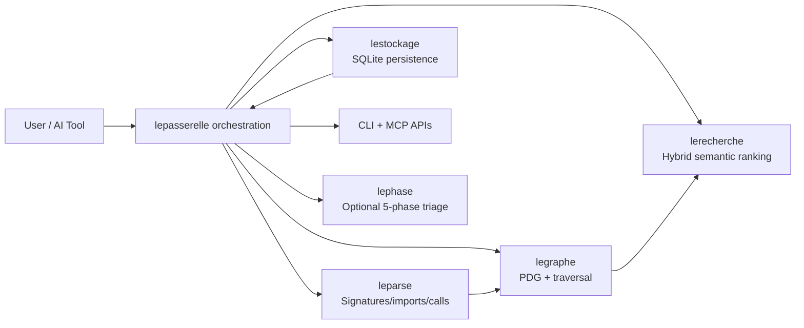
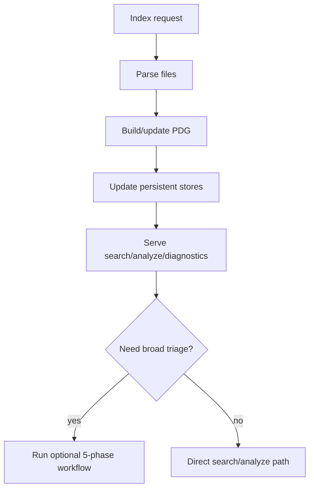

# LeIndex Architecture

Last updated: 2026-02-05

LeIndex is a Rust code intelligence system with five primary planes:
1) Parsing
2) Graph intelligence
3) Semantic search/ranking
4) Persistent storage
5) Delivery surfaces (CLI + MCP)

The 5-phase workflow (`lephase`) is an additive triage subsystem built on top of these planes.

---

## 1) System overview

---

## 2) Workspace crates

| Crate | Primary function |
|---|---|
| `leparse` | Multi-language parsing + signature extraction |
| `legraphe` | PDG extraction/merge/traversal and import relinking |
| `lerecherche` | Search engine, hybrid ranking, semantic processor, tiered HNSW/Turso vectors |
| `lestockage` | SQLite schema + node/edge stores + PDG persistence + global symbols |
| `lepasserelle` | CLI, MCP handlers/server, runtime orchestration |
| `lephase` | Structured five-phase analysis mode (additive) |

---

## 3) Core runtime data flow

---

## 4) Incremental correctness model

- File inventory hashing + generation tracking
- Changed/deleted detection
- Parse-failure-safe graph replacement
- Normalized file-key handling (relative/absolute stability)
- Cache corruption tolerance (miss + recovery)

These behaviors are shared system guarantees; the 5-phase mode consumes them rather than replacing core flows.

---

## 5) 5-phase subsystem (where it fits)

`lephase` provides a compact triage report:
- P1 structure
- P2 dependency map
- P3 impact flow
- P4 hotspots
- P5 recommendations

It is designed to reduce exploratory overhead before targeted search/analyze/manual review.

---

## 6) User-facing surfaces

### CLI
- `leindex index`
- `leindex search`
- `leindex analyze`
- `leindex diagnostics`
- `leindex phase` (additive)

### MCP
- `leindex_index`
- `leindex_search`
- `leindex_deep_analyze`
- `leindex_context`
- `leindex_diagnostics`
- `leindex_phase_analysis` / `phase_analysis` (additive)

---

## 7) Token-efficiency note

Phase-mode triage can drastically reduce early context/token load, but LeIndex’s core value is broader:
parsing + graph + search + storage + MCP automation.
