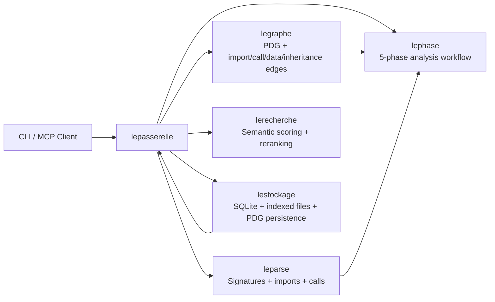
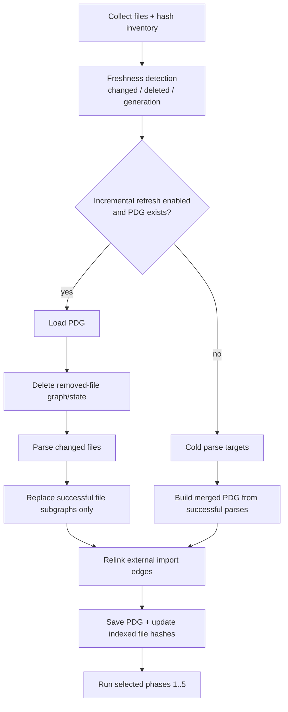
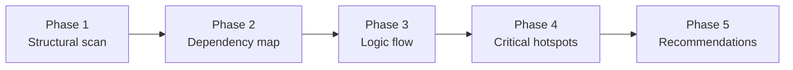

# LeIndex Architecture (with 5-Phase Analysis)

Last updated: 2026-02-05

This document describes the current Rust architecture, including the **lephase** 5-phase analysis system.

---

## 1) System overview

LeIndex is a Rust workspace where `lepasserelle` orchestrates parsing, graph construction, search, persistence, and phase analysis.

---

## 2) Workspace crate map

| Crate | Role |
|---|---|
| `leparse` | Language parsing and signature extraction |
| `legraphe` | PDG extraction, merge, traversal, relinking |
| `lerecherche` | Semantic ranking / hybrid scorer |
| `lestockage` | Persistent metadata + PDG/indexed-file state |
| `lepasserelle` | CLI/MCP server + top-level orchestration |
| `lephase` | Five-phase analysis pipeline and orchestration |

---

## 3) 5-phase execution model

`lephase` runs from a shared execution context with freshness-aware incremental behavior.

### Important correctness rules

- Parse-failure-safe updates: failed files do **not** overwrite prior valid graph state.
- Cold-path safety: only successful parses are marked indexed/fresh.
- Path normalization: relative/absolute key forms are normalized for stable freshness behavior.
- Cache integrity: corrupted/envelope-mismatched cache entries degrade to cache miss (no crash).

---

## 4) Five phases in detail

### Phase outputs

- **P1:** files parsed, parse failures, parser completeness, language distribution.
- **P2:** internal/external import edges, unresolved modules.
- **P3:** entry points, impacted nodes, ranked focus files.
- **P4:** ranked hotspots (complexity + impact + text signal).
- **P5:** actionable prioritized recommendations.

---

## 5) CLI and MCP surfaces

### CLI (additive)

- `leindex phase --all --path <repo>`
- `leindex phase --phase <1..5> --path <repo>`

### MCP tools (additive)

- `leindex_phase_analysis`
- `phase_analysis` (alias)

Both coexist with existing `index/search/analyze/context/diagnostics` interfaces.

---

## 6) Token-efficiency architecture impact

The 5-phase system is intentionally designed to produce **compact triage summaries** before LLM deep reading.

### Measured benchmark

Repository-scale benchmark on live installed binary:

- Repository size: **1,974 files**
- Command: `leindex phase --all --mode balanced --max-chars 12000`
- Output: **473 chars (~118 tokens)**

Grep/manual baseline for equivalent triage scope:

- 3 grep passes + 15 candidate files read
- Output/context consumed: **105,089 chars (~26,272 tokens)**

Token reduction: **~99.55%** before detailed manual review.

---

## 7) Manual reading vs phase analysis

- **Phase analysis is better** for broad impact discovery and fast triage.
- **Manual reading is better** for final semantic intent, business logic nuances, and sign-off decisions.

Recommended operational model:
1. Run phase analysis to reduce search/read scope.
2. Manually inspect focus files/hotspots.
3. Use semantic search/context expansion for targeted follow-up.

---

## 8) Installer-to-runtime guarantee

Installers now validate that the installed binary exposes:

- `leindex phase --help`
- `leindex mcp --help`
- a phase-analysis smoke run on a temp project

This ensures live installs reflect shipped 5-phase capabilities.
