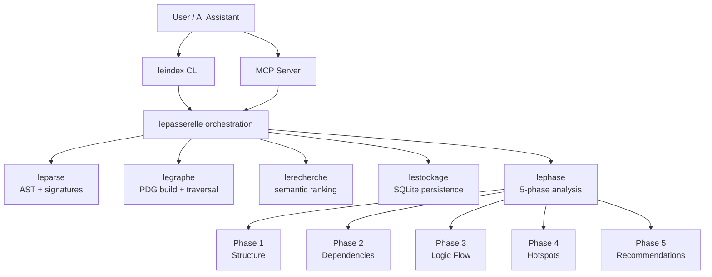

# LeIndex

<div align="center">


[](https://www.rust-lang.org/)
[](https://modelcontextprotocol.io)
[](LICENSE)

**Code analysis that cuts token burn before it cuts your budget.**

</div>

---

## ⚠️ Read this first (non-technical)

If you use AI to understand codebases, your biggest hidden cost is **token waste**.

LeIndex’s new **5-phase analysis system** gives you a compact, structured map of a codebase *before* you start asking an LLM to read dozens of files.

### Real-world benchmark (measured)

Measured on this repository with a live installed build (`leindex 0.1.0`) and **1,974 source files**:

| Approach | Output size | Approx tokens | Time |
|---|---:|---:|---:|
| `leindex phase --all` | 473 chars | ~118 | 18.6s |
| Grep + manual triage (3 rg passes + 15 files read) | 105,089 chars | ~26,272 | analyst-dependent |

**Token reduction:** ~26,154 tokens (**~99.55% less**) before deep reading starts.

> Why this matters urgently: if your team does 10 impact investigations/day, this pattern can prevent ~261k tokens/day of avoidable context flooding.

---

## What the 5-phase system does (plain English)

LeIndex doesn’t just “search text.” It performs a staged analysis:

1. **Phase 1 – Structural scan**
   - What languages/files parsed successfully, where parsing failed, how complete parser coverage is.
2. **Phase 2 – Dependency map**
   - Import relationships, internal vs external dependencies, unresolved modules.
3. **Phase 3 – Logic-flow focus**
   - Entry points, forward impact, and ranked focus files.
4. **Phase 4 – Critical path hotspots**
   - Nodes likely to create high risk/change impact.
5. **Phase 5 – Action recommendations**
   - Prioritized next steps and optimization hints.

---

## Is this better than manually reading files?

### Better than manual-only (for triage)
- Faster initial orientation on large repos.
- More consistent than ad-hoc grep habits.
- Captures graph relationships humans miss under time pressure.
- Produces compact summaries that are LLM-friendly.

### Worse than manual reading (for final judgment)
- Cannot fully understand business intent or undocumented tribal knowledge.
- Heuristics can over/under-rank some hotspots.
- Final design/security decisions still require human code reading.

### Best practice
Use **5-phase first** to shrink scope, then manually read only the ranked focus files.

---

## Core capabilities

- Semantic code search (not just keyword matching)
- Program Dependence Graph (PDG) analysis
- Incremental freshness-aware refresh
- Additive CLI + MCP integration
- 5-phase analysis (single phase or full run)
- Optional docs analysis (explicit opt-in only)

---

## Quick start

### Install

```bash
curl -sSL https://raw.githubusercontent.com/scooter-lacroix/leindex/main/install.sh | bash
```

### Verify

```bash
leindex --version
leindex phase --help
```

### Use

```bash
# 1) Build index
leindex index /path/to/project

# 2) Run full 5-phase analysis
leindex phase --all --path /path/to/project

# 3) Run a single phase (example: dependency map)
leindex phase --phase 2 --path /path/to/project

# 4) Run semantic search
leindex search "where is authentication enforced"
```

---

## MCP tools (AI assistants)

LeIndex exposes MCP tools for indexing/search/context and 5-phase analysis, including:

- `leindex_index`
- `leindex_search`
- `leindex_deep_analyze`
- `leindex_context`
- `leindex_diagnostics`
- `leindex_phase_analysis` (and alias `phase_analysis`)

---

## Architecture (updated)



---

## Documentation

- [ARCHITECTURE.md](ARCHITECTURE.md)
- [RUST_ARCHITECTURE.md](RUST_ARCHITECTURE.md)
- [API.md](API.md)
- [QUICK_START.md](QUICK_START.md)
- [docs/FIVE_PHASE_TOKEN_EFFICIENCY.md](docs/FIVE_PHASE_TOKEN_EFFICIENCY.md)
- [INSTALLATION.md](INSTALLATION.md)

---

## License

MIT OR Apache-2.0
