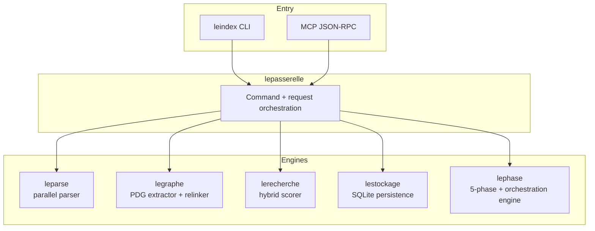
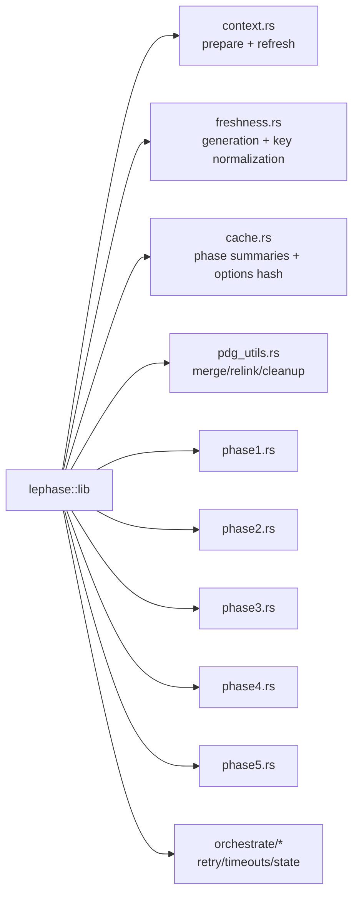

# LeIndex Rust Architecture Deep Dive (5-Phase Enabled)

Last updated: 2026-02-05

This document is the technical companion to `ARCHITECTURE.md`, focused on runtime behavior and component boundaries.

---

## A) Runtime topology

---

## B) Phase subsystem composition

---

## C) Data contracts

### `PhaseExecutionContext`

Shared run-state carrying:
- root/project/storage
- file inventory + changed/deleted sets
- parse results + signatures by file
- merged PDG
- docs summary (optional)
- generation hash

### `PhaseOptions`

Key fields:
- `root`, `mode`, `max_files`, `top_n`, `max_focus_files`, `max_output_chars`
- `use_incremental_refresh`
- docs controls: `include_docs`, `docs_mode`
- hotspot heuristic controls: `hotspot_keywords`

### `PhaseAnalysisReport`

Includes:
- executed phases
- cache-hit flag
- per-phase summaries
- compact formatted output for AI-friendly consumption

---

## D) Correctness-focused behavior

### Freshness and path normalization

- Freshness compares normalized relative/absolute keys.
- Indexed-file updates use canonical project-relative keys.
- Equivalent file-key handling prevents perpetual “changed” loops.

### Parse-failure safety

- Incremental path replaces file graph only on successful parse.
- Cold path records freshness only for successfully parsed files.

### Cache validity

- Corrupt JSON cache -> cache miss + cleanup.
- Envelope mismatch (`project/generation/phase/options_hash`) -> miss.
- Phases 3–5 use options-sensitive hash discriminators.

### Import relinking quality

- Ranked candidate resolution.
- Bounded relinking to avoid edge explosion.
- Module-level preference for module-like imports.
- Orphan external module cleanup post-relink.

---

## E) Orchestration semantics

`lephase::orchestrate` supports:
- retry budgets,
- wall-clock timeout budgets,
- persisted lifecycle state,
- completed-phase tracking.

API clarity update:
- `restore_state_snapshot(...)` is the explicit semantic method.
- `resume_from_state(...)` remains as backward-compatible alias.

---

## F) Public interfaces (additive)

### CLI
- `leindex phase --phase <1..5> --path <repo>`
- `leindex phase --all --path <repo>`

### MCP
- `leindex_phase_analysis`
- `phase_analysis` alias

No breaking changes were introduced to existing `leindex analyze` usage.

---

## G) Performance + token efficiency impact

### Why 5-phase helps token efficiency

Instead of dumping raw file content into an LLM, LeIndex emits a compact staged summary first.
This shrinks prompt context dramatically and focuses manual follow-up on high-impact files.

### Measured run

- `leindex phase --all --path . --mode balanced --max-chars 12000`
- Output size: **473 chars (~118 tokens)**
- Runtime: ~18.6s on 1,974 files

Compared with grep/manual triage sample:
- ~105,089 chars (~26,272 tokens)
- ~99.55% token reduction before deep analysis

---

## H) Benchmark scope update

The phase benchmark harness now covers:
- XS scenarios (cold/warm/incremental)
- S-tier import-linked scenarios (cold/incremental)

This better reflects realistic dependency-walk workloads beyond tiny synthetic samples.
