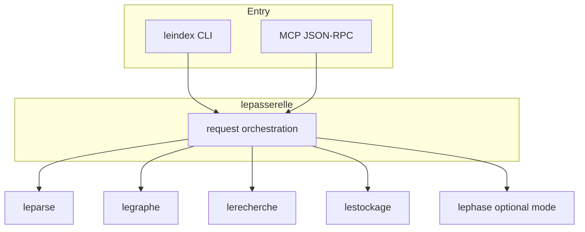
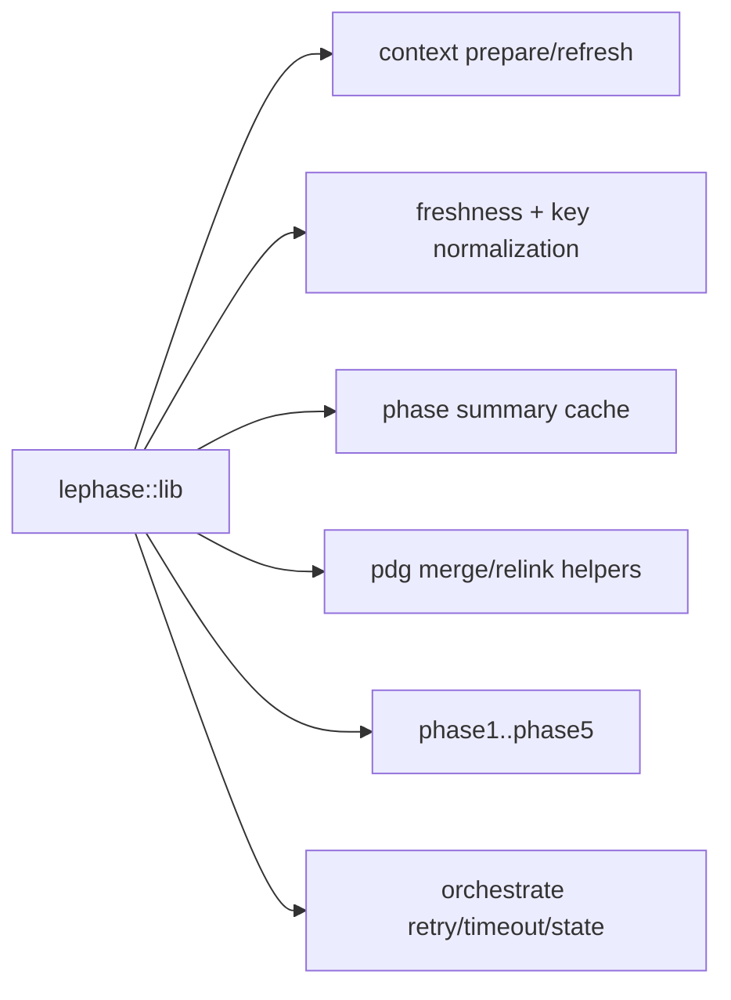

# LeIndex Rust Architecture Deep Dive

Last updated: 2026-02-05

This document focuses on runtime behavior and crate boundaries for the full LeIndex system.
`lephase` is covered as one subsystem, not the whole runtime.

---

## A) Runtime topology

---

## B) Core planes

### Parsing plane (`leparse`)
- Signature extraction across supported languages
- Calls/imports metadata used downstream by graph/search

### Graph plane (`legraphe`)
- PDG build/merge
- Call/data/inheritance/import edge handling
- Traversal and relink behavior

### Search plane (`lerecherche`)
- Query parsing and intent weighting
- Hybrid scoring/reranking
- Semantic context expansion support
- Tiered vector backend: in-memory HNSW hot tier + Turso-backed cold tier spill

### Storage plane (`lestockage`)
- SQLite schema + migrations
- Indexed file hashes (incremental refresh)
- Node/edge persistence and PDG storage bridge
- Global symbol and cross-project references

### Delivery plane (`lepasserelle`)
- CLI command routing
- MCP tool handlers + server protocol
- Diagnostics and runtime control

---

## C) 5-phase subsystem (`lephase`)

`lephase` provides compact staged triage output:
- P1 structure
- P2 dependencies
- P3 logic-flow impact
- P4 hotspots
- P5 recommendations

---

## D) Cross-cutting correctness guarantees

- Incremental freshness with normalized path keys
- Parse-failure-safe updates (no destructive overwrite on failed parse)
- Corruption-tolerant cache handling
- Bounded import relinking and orphan cleanup
- Additive CLI/MCP interfaces (no breakage to existing analyze path)

---

## E) Public interfaces (additive)

### Core commands
- `leindex index`
- `leindex search`
- `leindex analyze`
- `leindex diagnostics`

### Optional phase mode
- `leindex phase --phase <1..5> --path <repo>`
- `leindex phase --all --path <repo>`

### MCP
- Core: index/search/deep_analyze/context/diagnostics
- Additive: `leindex_phase_analysis`, `phase_analysis`

---

## F) Performance perspective

The 5-phase mode improves early triage token efficiency, but the full platform value is the combination of:
- parser fidelity,
- graph intelligence,
- semantic ranking,
- storage-backed incrementality,
- MCP automation.
