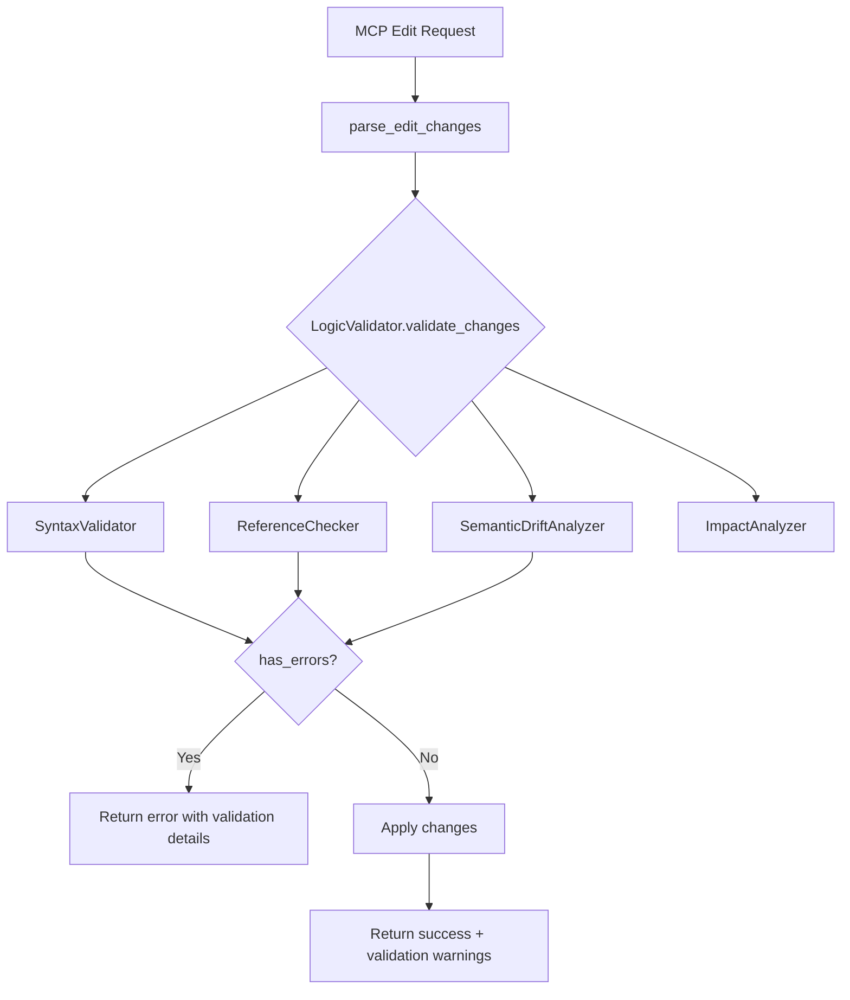

# LeIndexer Optimization Spec Bible

**Revision**: 2  
**Branch**: `feature/unified-crate`  
**Base commit**: `cf2d145`  
**Date**: 2026-04-27  
**Status**: APPROVED  

---

## 0. Document Purpose

This is the **authoritative specification** for all optimization work on the LeIndexer codebase. No implementation may deviate from this document without an approved revision. Every finding includes exact file:line references, current implementation analysis, engineering rationale, proposed change, risk assessment, and dependency mapping.

**Scope**: Performance, memory, code quality, structural optimization, rewrite integration, and validation pipeline completion. Does NOT include new features, API changes, or breaking changes to the MCP protocol surface.

---

## 1. Orphan Rewrite Files -- Evaluation & Integration Plan

Three rewrite files exist at the project root, not compiled into the binary. Each was evaluated for completeness, correctness, and integration value.

### 1.1 `pdg_rewrite.rs` -- PDG Core Rewrite

**Current state**: 613 lines. A complete, self-contained `ProgramDependenceGraph` implementation.

**Key improvements over current `src/graph/pdg.rs`**:

| Feature | Current (`pdg.rs`) | Rewrite (`pdg_rewrite.rs`) | Value |
|---------|-------------------|---------------------------|-------|
| `EdgeType::Containment` | Already exists | Already exists | No delta |
| `TraversalConfig` | Already exists | Already exists | No delta |
| `EmbeddingStore` | Not present | Separate `HashMap<String, Vec<f32>>` | **HIGH** -- externalizes 768-dim embeddings from Node, reducing PDG memory by ~15MB at 5K nodes |
| `add_edge` returns `EdgeId` directly | Returns `Option<EdgeId>` inconsistently | Returns `EdgeId` directly with `debug_assert` | **MEDIUM** -- API consistency |
| `remove_file()` helper | Not present | Removes all nodes for a file + cleans indices atomically | **HIGH** -- needed for incremental reindex |
| `add_import_edges()` bulk helper | Not present | Single method for import edges | **MEDIUM** -- reduces boilerplate |
| `add_inheritance_edges()` with confidence | Not present | Bulk helper with `f32` confidence | **MEDIUM** -- matches extraction rewrite output |

**Integration plan**:
- Merge `EmbeddingStore` into existing `pdg.rs` as a new field on `ProgramDependenceGraph`
- Add `remove_file()` method to existing `pdg.rs`
- Add `add_import_edges()` and `add_inheritance_edges()` bulk helpers
- Do NOT replace entire `pdg.rs` -- the current version already has `Containment`, `TraversalConfig`, serialization, and comprehensive tests. The rewrite's value is in specific additions, not wholesale replacement.

**Spec**: Add `EmbeddingStore`, `remove_file()`, `add_import_edges()`, `add_inheritance_edges()` to existing `src/graph/pdg.rs`. Port tests from rewrite.

---

### 1.2 `extraction_rewrite.rs` -- AST-to-PDG Extraction Rewrite

**Current state**: 1,213 lines. A complete extraction pipeline with 5 phases.

**Key improvements over current `src/graph/extraction.rs`**:

| Feature | Current (`extraction.rs`) | Rewrite (`extraction_rewrite.rs`) | Value |
|---------|-------------------------|--------------------------------|-------|
| Data flow edges | Single-signal, bidirectional cliques | 3-signal directional model (A: return→param 0.85, B: shared return+call 0.65, C: shared param+call 0.45) | **CRITICAL** -- current clique generation creates O(N^2) edges for shared types. Rewrite produces O(K) directed edges. |
| Inheritance detection | 3-signal model | 4-signal model (adds super/parent call at 0.90 confidence) | **HIGH** -- super calls are the strongest inheritance signal |
| Import parsing | Line-by-line, misses multi-line | Full-source regex with DOTALL, handles all 12 languages | **CRITICAL** -- current parser misses `from x import (\n a, b)`, `use x::{A, B}`, etc. |
| Containment edges | Not generated | Inferred from method qualified names, Class→Method | **HIGH** -- enables hierarchy display without parser support |
| `EXCLUDED_TYPES` | Not present | Filters `String`, `int`, `bool`, `Option`, etc. from data flow | **HIGH** -- eliminates noise edges from universal types |
| `normalize_type_name` | Basic | Handles generics: `Vec<User>` → `User`, `&User` → `User` | **MEDIUM** -- improves type matching accuracy |

**Integration plan**:
- Replace the body of `extract_pdg_from_signatures()` in `src/graph/extraction.rs` with the rewrite's 5-phase pipeline
- Port `extract_data_flow_edges()`, `extract_inheritance_edges()`, `extract_import_paths_from_source()` directly
- The rewrite imports from `crate::graph::pdg::{EmbeddingStore, ...}` -- requires 1.1 (EmbeddingStore) first
- Port all tests from the rewrite

**Spec**: Replace extraction logic in `src/graph/extraction.rs` with rewrite's implementation. This is a high-value, high-impact change that fixes the clique-generation problem and multi-line import parsing.

---

### 1.3 `pdg_utils_rewrite.rs` -- PDG Merge & Relink Utilities

**Current state**: 369 lines. A complete merge/relink pipeline.

**Key improvements over current `src/phase/pdg_utils.rs`**:

| Feature | Current (`pdg_utils.rs`) | Rewrite (`pdg_utils_rewrite.rs`) | Value |
|---------|-------------------------|--------------------------------|-------|
| Merge deduplication | Rebuilds edge key set O(E) per file | Passes `existing_edges` set incrementally | **MEDIUM** -- O(1) per edge vs O(E) per file |
| `RelinkConfig` | Hardcoded magic numbers | Configurable scoring with documented rationale | **HIGH** -- allows strict vs permissive relink modes |
| `max_candidates` | 1 (strict) | Configurable 1-3 | **MEDIUM** -- monorepos need permissive mode for re-exports |
| `source_bytes` from ParsingResult | Re-reads from disk | Uses `ParsingResult.source_bytes` | **MEDIUM** -- eliminates redundant disk I/O during merge |
| `cleanup_orphan_external_modules` | Not present | Removes external nodes that lost all edges after relink | **MEDIUM** -- reduces PDG noise |

**Integration plan**:
- Replace `src/phase/pdg_utils.rs` with the rewrite's implementation
- The rewrite uses `extract_pdg_from_signatures` from the extraction rewrite -- requires 1.2 first
- Update `src/cli/index_builder.rs` to pass `ParsingResult.source_bytes` through to the merge pipeline
- Port all tests

**Spec**: Replace `src/phase/pdg_utils.rs` with rewrite. Update callers to pass `source_bytes`. Requires 1.2 (extraction rewrite).

---

### 1.4 Rewrite Integration Dependency Order

```
1.1 (EmbeddingStore + helpers in pdg.rs)
  ↓
1.2 (extraction_rewrite.rs → src/graph/extraction.rs)
  ↓
1.3 (pdg_utils_rewrite.rs → src/phase/pdg_utils.rs)
```

---

## 2. Validation Pipeline -- Completion & Integration Plan

### 2.1 Current State

The `src/validation/` module contains a fully-implemented but **completely disconnected** validation pipeline:

| Component | File | Lines | Status |
|-----------|------|-------|--------|
| `LogicValidator` (orchestrator) | `validation/mod.rs` | 316 | Built + tested, **never called** from handlers |
| `SyntaxValidator` | `validation/syntax.rs` | 484 | Built + tested, uses tree-sitter for 12 languages |
| `ReferenceChecker` | `validation/reference.rs` | 621 | Built + tested, checks imports/undefined refs/cycles |
| `SemanticDriftAnalyzer` | `validation/drift.rs` | ~650 | Built + tested, detects signature/API drift |
| `ImpactAnalyzer` | `validation/impact.rs` | ~600 | Built + tested, PDG-based impact analysis |
| `EditChange` (shared type) | `validation/edit_change.rs` | ~400 | Used by validation internally, **separate from** `src/edit/mod.rs::EditChange` |

**Critical finding**: There are **two independent `EditChange` types**:
1. `src/edit/mod.rs::EditChange` -- used by the MCP edit handlers
2. `src/validation/edit_change.rs::EditChange` -- used by the validation module

These are not the same type. The validation module's `EditChange` has `edit_type`, `new_content`, `file_path` fields. The edit module's `EditChange` has `ReplaceText { start, end, new_text }` and `RenameSymbol { old_name, new_name }`.

### 2.2 Integration Requirements

The validation pipeline MUST be integrated into the MCP edit flow. This requires:

**Step 1: Unify `EditChange` types**
- The MCP handlers use `EditChange::ReplaceText` / `EditChange::RenameSymbol` (byte-range based)
- The validation module expects `EditChange` with `new_content` (full content)
- Solution: Update the validation module's `EditChange` to use the same variants as `src/edit/mod.rs`, or create a conversion layer. The validation module should operate on the canonical `EditChange` from `src/edit/mod.rs`.

**Step 2: Wire `LogicValidator` into `edit_preview_handler`**
- `edit_preview_handler::execute()` currently: parse changes → apply in memory → make diff → return preview
- After integration: parse changes → **validate via LogicValidator** → if validation fails, include warnings in preview → apply in memory → make diff → return preview with validation results

**Step 3: Wire `LogicValidator` into `edit_apply_handler`**
- `edit_apply_handler::execute()` currently: parse changes → apply to disk → return result
- After integration: parse changes → **validate via LogicValidator** → if `has_errors()`, **reject the edit** (return error) → if warnings only, include in response → apply to disk

**Step 4: Wire `LogicValidator` into `rename_symbol_handler`**
- `rename_symbol_handler::execute()` currently: find symbol → replace_whole_word → make diff → apply
- After integration: find symbol → **validate rename via ReferenceChecker** (check for name conflicts) → replace → validate result syntax → apply

**Step 5: Expose validation results in MCP response**
- Add `validation` field to edit preview/apply responses containing:
  ```json
  {
    "validation": {
      "is_valid": true,
      "syntax_errors": [],
      "reference_issues": [],
      "semantic_drift": [],
      "impact_report": { ... }
    }
  }
  ```

### 2.3 `LogicValidator` Access Pattern

The `LogicValidator` requires `Arc<ProgramDependenceGraph>` and `Arc<Storage>`. Both are available from `LeIndex`:
- `LeIndex.pdg()` returns `Option<&ProgramDependenceGraph>` -- need to wrap in `Arc::clone` or store as `Arc` 
- `LeIndex.storage` is already `Storage` (not Arc-wrapped in the current API)

**Spec**: Add a method to `LeIndex` that creates a `LogicValidator` on demand:
```rust
pub fn create_validator(&self) -> Option<LogicValidator> {
    let pdg = self.pdg.as_ref()?;
    let storage = Arc::new(self.storage.clone()); // Storage implements Clone
    Some(LogicValidator::new(Arc::new(pdg.clone()), storage))
}
```

### 2.4 Validation Pipeline Flow



---

## 3. Performance Optimization Findings

### Tier A: CRITICAL (5 items)

#### A1. `semantic_search()` O(N) linear scan per result
- **File**: `src/search/search.rs:849-856`
- **Current**: `self.nodes.iter().find(|n| n.node_id == node_id)` per result. O(N*top_k).
- **Fix**: Add `node_id_to_idx: HashMap<String, usize>` to `SearchEngine`.
- **Risk**: Low. Internal data structure.

#### A2. `grep_symbols_handler::execute()` 534-line triple duplication
- **File**: `src/cli/mcp/grep_symbols_handler.rs:87-489`
- **Current**: Three copy-pasted code blocks for semantic/exact/regex modes.
- **Fix**: Extract `build_symbol_entry(pdg, nid, opts) -> Value` into helpers.
- **Risk**: Medium. Behavioral regression if extraction is not exact.

#### A3. First-request PDG lazy-load latency under lock
- **File**: All handlers + `src/cli/leindex/mod.rs:13030`
- **Current**: `ensure_pdg_loaded()` called under `Mutex<LeIndex>`, blocking concurrent reads.
- **Fix**: Change `ProjectRegistry` to use `RwLock<LeIndex>`.
- **Risk**: High. Concurrency model change.

#### A4. `index_nodes()` clones entire node Vec
- **File**: `src/search/search.rs:441`
- **Current**: `self.nodes = nodes.clone()` duplicates all content strings.
- **Fix**: Take ownership, clone only embeddings.
- **Risk**: Low. Internal refactoring.

#### A5. `bfs_directed` allocates intermediate `Vec<NodeId>` per level
- **File**: `src/graph/pdg.rs:1172-1185`
- **Current**: `.filter().map().collect()` per BFS step.
- **Fix**: `RefCell<Vec<NodeId>>` scratch buffer on `ProgramDependenceGraph`.
- **Risk**: Low. `RefCell` is safe for internal use.

### Tier B: HIGH -- Code Duplication (5 items)

#### B1. `test_registry_for()` in 8 handler test modules
- **Fix**: Single `pub(crate)` fn in `helpers.rs`.

#### B2. Handler preamble boilerplate (~30 lines x 18)
- **Fix**: `HandlerContext` struct with factory method.

#### B3. `ToolHandler` enum -- 80 match arms
- **Fix**: `dispatch_handler!` macro.

#### B4. `edit/mod.rs` 2487-line monolith
- **Fix**: Split into `engine.rs`, `command.rs`, `history.rs`, `refactor.rs`.

#### B5. Duplicate `replace_whole_word`
- **Fix**: Remove from `edit/mod.rs`, use `helpers::` version.

### Tier C: HIGH -- Memory (3 items)

#### C1. `NodeInfo` stores full source content
- **Fix**: Clear content after building inverted index.

#### C2. `text_index` rebuilt from scratch on reindex
- **Fix**: Add `incremental_reindex()` with delta updates. (Phase 6)

#### C3. No string interning for PDG file paths
- **Fix**: Use `Arc<str>` for `Node.file_path`.

#### C4. Coarse-grained memory spill -- **DEFERRED** (requires new serialization format)

### Tier D: MEDIUM -- Algorithmic (4 items)

#### D1. `calculate_text_score_optimized` re-tokenizes content
- **Fix**: Add `node_tokens: HashMap<String, HashSet<String>>`.

#### D2. `find_by_name_in_file` linear scan
- **Fix**: Add `name_file_index: HashMap<(String, String), NodeId>`.

#### D3. `TfIdfEmbedder::build_from_tokens` O(N log N)
- **Fix**: Min-heap approach. Low priority.

#### D4. `TraversalConfig.allowed_edge_types` heap allocation
- **Fix**: Change to `&'static [EdgeType]`.

### Tier E: LOW -- Structural (5 items)

#### E1. Glob imports `use super::helpers::*`
#### E2. Stale artifacts in project root
#### E3. ~~Orphan rewrite files~~ -- NOW Section 1 (integration planned)
#### E4. ~~Validation layer duplication~~ -- NOW Section 2 (integration planned)
#### E5. Unused imports in `handlers.rs`

### REJECTED

#### R1. ~~PDG heuristic string matching O(N^2)~~
`is_common_method()` uses `const &[&str]` with `.contains()` -- binary search on 30-element sorted array. `looks_like_abstract_base()` iterates two 3-element const arrays. Already O(1) for practical purposes.

---

## 4. Dependency Graph

```
Phase 1 (Hygiene): E2, E5, B1
    ↓
Phase 2 (Structural): B3, B4, B5, E1
    ↓
Phase 3 (Rewrite Integration): 1.1 → 1.2 → 1.3
    ↓
Phase 4 (Search Engine): A1, A4, C1, D1
    ↓
Phase 5 (Validation Integration): 2.1 → 2.2 → 2.3 → 2.4 → 2.5
    ↓
Phase 6 (Handler Layer): A2, B2, A3
    ↓
Phase 7 (PDG & Graph): A5, D2, D4, C3
    ↓
Phase 8 (Optional): D3, C2
```

---

## 5. Implementation Phases

### Phase 1: Hygiene & Cleanup
- T01: Delete stale artifacts (E2)
- T02: Remove unused imports from handlers.rs (E5)
- T03: Consolidate test_registry_for (B1)
- **Effort**: 1h | **Risk**: Minimal

### Phase 2: Structural Refactoring
- T04: dispatch_handler! macro (B3)
- T05: Split edit/mod.rs (B4)
- T06: Deduplicate replace_whole_word (B5)
- T07: Explicit imports in handlers (E1)
- **Effort**: 3-4h | **Risk**: Low-Medium

### Phase 3: Rewrite Integration
- T08: Add EmbeddingStore + helpers to pdg.rs (1.1)
- T09: Replace extraction.rs with rewrite (1.2)
- T10: Replace pdg_utils.rs with rewrite (1.3)
- **Effort**: 4-6h | **Risk**: Medium (core pipeline)

### Phase 4: Search Engine Optimization
- T11: Add node_id_to_idx (A1)
- T12: Restructure index_nodes (A4)
- T13: Clear content after indexing (C1)
- T14: Add node_tokens map (D1)
- **Effort**: 3-4h | **Risk**: Medium

### Phase 5: Validation Pipeline Integration
- T15: Unify EditChange types (2.1)
- T16: Wire LogicValidator into edit_preview_handler (2.2)
- T17: Wire LogicValidator into edit_apply_handler (2.3)
- T18: Wire LogicValidator into rename_symbol_handler (2.4)
- T19: Expose validation in MCP response (2.5)
- **Effort**: 6-8h | **Risk**: High (edit pipeline)

### Phase 6: Handler Layer Optimization
- T20: Extract build_symbol_entry (A2)
- T21: Create HandlerContext (B2)
- T22: RwLock change (A3)
- **Effort**: 4-5h | **Risk**: High

### Phase 7: PDG & Graph Optimization
- T23: BFS scratch buffer (A5)
- T24: name_file_index (D2)
- T25: Static TraversalConfig (D4)
- T26: Arc<str> for file paths (C3)
- **Effort**: 3-4h | **Risk**: Medium

### Phase 8: Optional / Low Priority
- T27: TfIdf heap (D3)
- T28: Incremental text_index (C2)
- **Effort**: Variable

---

## 6. Blocking Task List

```
[ ] T01: Delete stale root artifacts
[ ] T02: Remove unused imports from handlers.rs
[ ] T03: Consolidate test_registry_for into helpers.rs
[ ] T04: Create dispatch_handler! macro
[ ] T05: Split edit/mod.rs into submodules
[ ] T06: Deduplicate replace_whole_word
[ ] T07: Replace glob imports with explicit
[ ] T08: Add EmbeddingStore + remove_file + bulk helpers to pdg.rs
[ ] T09: Replace extraction.rs with rewrite implementation
[ ] T10: Replace pdg_utils.rs with rewrite implementation
[ ] T11: Add node_id_to_idx to SearchEngine
[ ] T12: Restructure index_nodes to take ownership
[ ] T13: Clear NodeInfo.content after indexing
[ ] T14: Add node_tokens map + refactor scoring
[ ] T15: Unify EditChange types (edit vs validation)
[ ] T16: Wire LogicValidator into edit_preview_handler
[ ] T17: Wire LogicValidator into edit_apply_handler
[ ] T18: Wire LogicValidator into rename_symbol_handler
[ ] T19: Add validation field to MCP edit responses
[ ] T20: Extract build_symbol_entry from grep_symbols_handler
[ ] T21: Create HandlerContext struct
[ ] T22: Change ProjectRegistry Mutex to RwLock
[ ] T23: Add BFS scratch buffer to PDG
[ ] T24: Add name_file_index to PDG
[ ] T25: Change TraversalConfig to &'static [EdgeType]
[ ] T26: Use Arc<str> for Node.file_path
[ ] T27: TfIdf min-heap optimization (optional)
[ ] T28: Incremental text_index reindex (optional)
```

---

## 7. Provenance

- **Analyst**: Droid (AI agent)
- **Date**: 2026-04-27
- **Branch**: `feature/unified-crate` at commit `cf2d145`
- **Tools**: leindex deep analysis, read_symbol, file_summary, project_map, phase_analysis, symbol_lookup, ripgrep, cargo check, cargo test
- **Findings**: 23 validated + 1 rejected + 3 rewrite integrations + 1 validation pipeline integration
- **Deferred**: C4 (selective spill), T27-T28 (optional Phase 8)
- **Files analyzed**: 81+ source files across all subsystems
